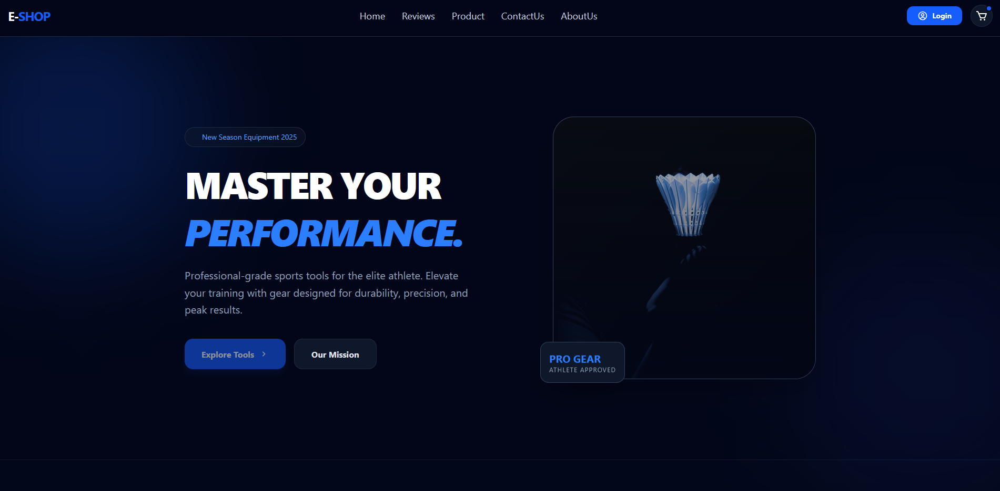
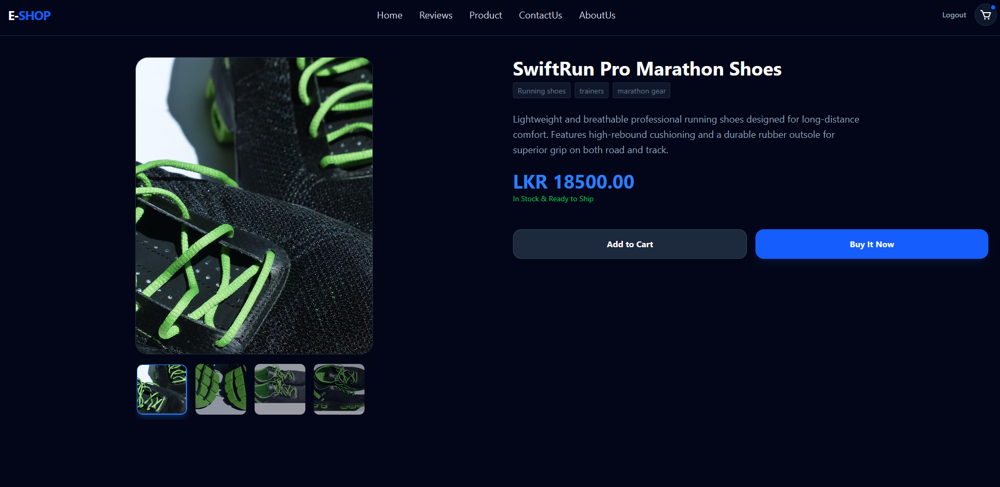
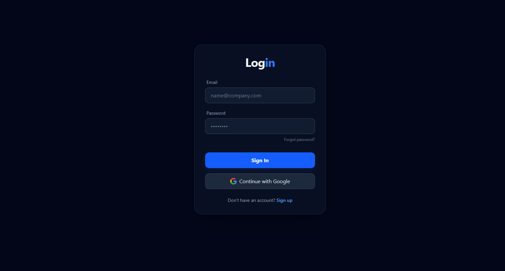
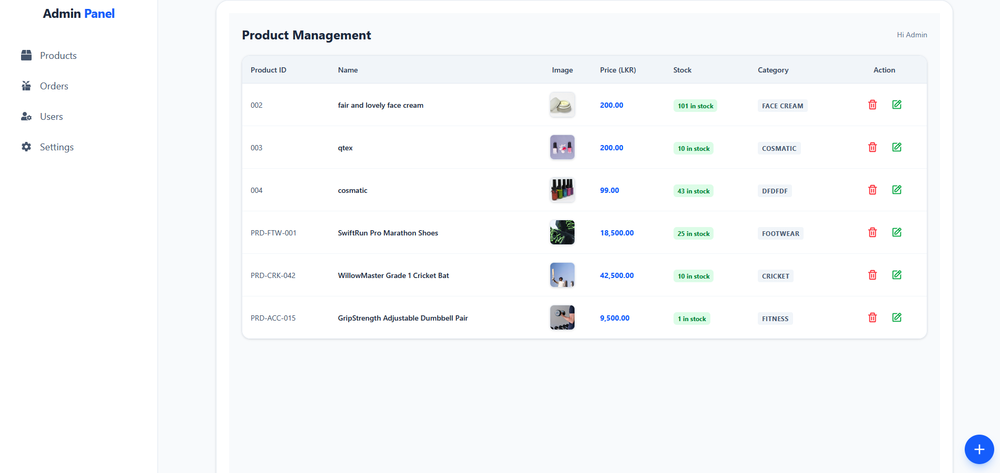
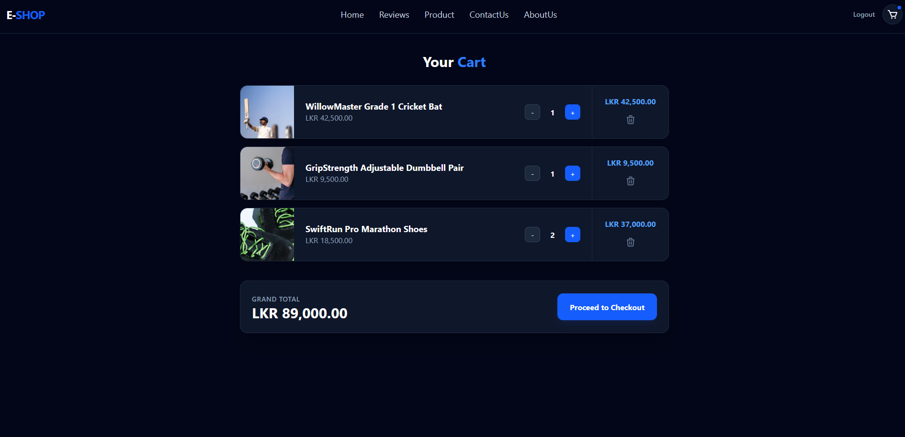
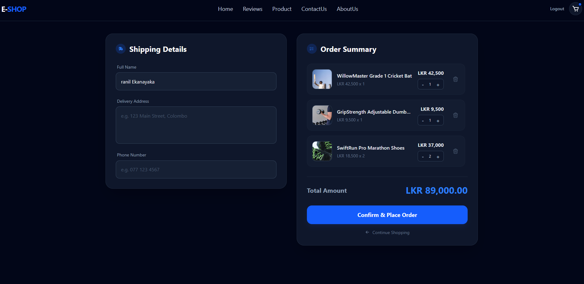
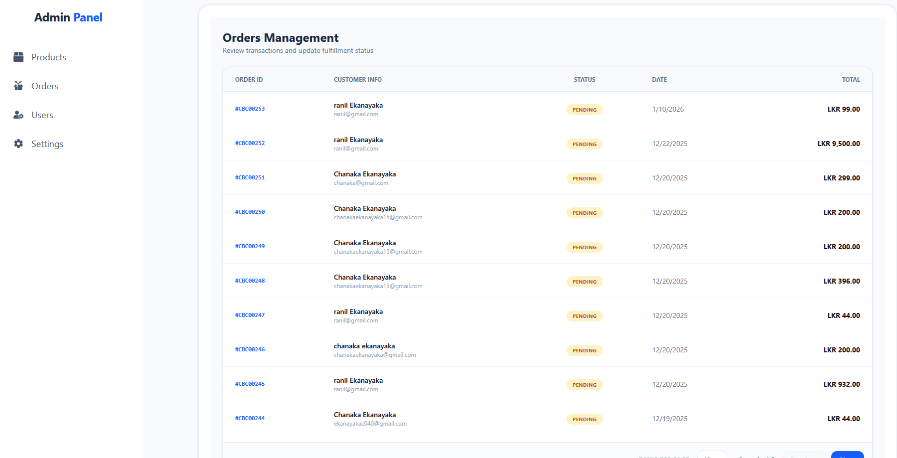
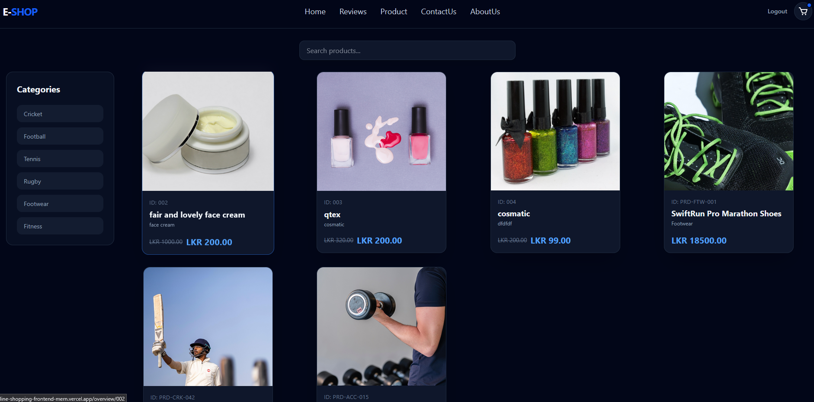

# 🏆 SportGear Elite | Modern MERN E-commerce

[](https://online-shopping-frontend-mern.vercel.app/)
[](https://github.com/chanakaekanayaka/online-shopping-frontend-mern.git)

SportGear Elite is a premium, full-stack e-commerce platform dedicated to high-performance sports tools and equipment. Built with the MERN stack (MongoDB, Express, React, Node.js), it offers a seamless shopping experience with AI-inspired UI/UX, robust state management, and a powerful administrative dashboard.

---

## ✨ Key Features

* **🛡️ Secure Authentication:** JWT-based login and registration with protected routes.
* **🛒 Advanced Shopping Cart:** Real-time cart updates with persistent storage.
* **📊 Dynamic Dashboard:** Comprehensive user profile and order tracking.
* **🔧 Admin Powerhouse:** Full CRUD capabilities for products, users, and order management.
* **💳 Seamless Checkout:** Integrated shipping and payment flow.
* **📱 Fully Responsive:** Optimized for mobile, tablet, and desktop using Tailwind CSS.

---

## 📸 Project Showcases

### 🏠 Landing Page & Product Overview
The gateway to premium sports gear, featuring modern layouts and high-performance tools.
<p align="center">
  
  
</p>

### 🔑 Authentication & Admin Portal
Secure login flows and a powerful management system for site administrators.
<p align="center">
  
  
</p>

### 🛍️ Shopping Experience
A streamlined path from cart selection to secure order placement.
<p align="center">
  
  
  
</p>

### 👤 User Dashboard
A personalized space for users to track history and manage their account.
<p align="center">
  
</p>

---

## 🛠️ Tech Stack

### Frontend
* **React.js** (Functional Components, Hooks)
* **Redux Toolkit** (State Management)
* **Tailwind CSS** (Modern Styling)
* **Lucide React** (Iconography)
* **React Router Dom** (Navigation)

### Backend
* **Node.js & Express** (Server-side logic)
* **MongoDB** (Database)
* **Cloudinary** (Image Hosting)
* **JWT** (Security)

---

## 🚀 Getting Started

To run this project locally, follow these steps:

1.  **Clone the repository:**
    ```bash
    git clone [https://github.com/chanakaekanayaka/online-shopping-frontend-mern.git](https://github.com/chanakaekanayaka/online-shopping-frontend-mern.git)
    ```

2.  **Install dependencies:**
    ```bash
    npm install
    ```

3.  **Setup Environment Variables:**
    Create a `.env` file in the root directory and add your credentials:
    ```env
    VITE_BACKEND_URL=your_backend_url
    ```

4.  **Start the development server:**
    ```bash
    npm run dev
    ```

---

## 🤝 Contribution

Contributions are what make the open-source community such an amazing place to learn, inspire, and create. Any contributions you make are **greatly appreciated**.

1. Fork the Project
2. Create your Feature Branch (`git checkout -b feature/AmazingFeature`)
3. Commit your Changes (`git commit -m 'Add some AmazingFeature'`)
4. Push to the Branch (`git push origin feature/AmazingFeature`)
5. Open a Pull Request

---

## 📄 License
Distributed under the MIT License. See `LICENSE` for more information.

**Built with ❤️ by [Chanaka Ekanayaka](https://github.com/chanakaekanayaka)**
